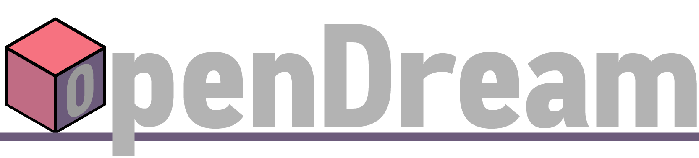

**OpenDream** is a C# project that aims to compile games made in the [DM language], and run them.

**This project is currently in early stages.** Expect bugs, missing features, and a lack of quality-of-life enhancements. Set your expectations accordingly.

All parts of OpenDream should work fine on Windows and Linux, though variability in Linux distributions makes it slightly less likely to work out of the box.

For more information or if you'd like to contribute, join our [Discord server](https://discord.gg/UScStz6hnQ).

A detailed description of differences with BYOND can be found [here](https://github.com/OpenDreamProject/OpenDream/wiki/Differences-Between-OpenDream-and-BYOND). **Note that an OpenDream client cannot connect to BYOND servers, and BYOND's client cannot connect to OpenDream servers.** There is no cross-project compatibility other than being able to migrate from BYOND to OpenDream with minimal effort.

## Running

### Very Easy Mode

Install the OpenDream vscode extension from [the marketplace](https://marketplace.visualstudio.com/items?itemName=ss13.opendream). Open the folder containing your `.dme` file in vscode. Press the "Start debugging (F5)" button.

The extension will automatically handle getting the latest OpenDream and SS14 Launcher binaries, compile and run everything for you.

If you want to develop OpenDream, you'll need to clone the OpenDream repository and add that folder to your workspace. The extension will automatically detect this and build from source instead.

### Running From Commandline

Binaries are available for download under our [Releases](https://github.com/OpenDreamProject/OpenDream/releases/tag/latest). If you would rather build from source, see [Building](#building).

There's 3 main parts: Compiler, Server, and Client:

**Compiler:** Run `DMCompiler.exe`, and pass any number of .dm or .dme files to compile as arguments. Optional arguments can be found [here](https://github.com/OpenDreamProject/OpenDream/wiki/Compiler-Options).

**Server:** Run `Robust.Server.exe` (`OpenDreamServer.exe` if built from source) and pass the compiled JSON file you got as a result of running the compiler above as an argument like this: `Robust.Server.exe C:/path/to/compiler/output.json`

**Client:** This is only applicable if you built from source, otherwise connect from the [SS14 launcher](https://spacestation14.io/about/nightlies/). Run `OpenDreamClient.exe`. You will be prompted to choose a server address, port, and username. The defaults should work for a locally hosted server.

## Building

The first step to building OpenDream is initializing the submodule for the game engine, [Robust Toolbox](https://github.com/space-wizards/RobustToolbox).

To do this, simply run `git submodule update --init --recursive` in git bash and let it finish.

**OpenDream requires .NET 9.** You can check your version by running `dotnet --version`. It should be at least `9.0.0`.

To build, one can use a C# compiler (such as MSBuild) to compile the various projects described in the solution. To use the .NET build system, simply run `dotnet build -c Release` in the OpenDream directory. This will build all of the solutions in release mode and put the resultant binaries in `bin`

## Testing

OpenDream makes use of a unit testing framework. You can run these unit tests by running `dotnet test` in the OpenDream directory. This will run all of the RobustToolbox tests, as well as the DM language tests which can be found under `Content.Tests/DMProject/Tests/`. To add to the unit tests, simply create a `.dm` file under the Tests directory with `/proc/RunTest()` as the entry point. Optionally you can also add flags to the test, such as `// COMPILE ERROR` to mark that this test should cause a compile error.

## Requests for Comment

New features unrelated to BYOND parity go through an RFC process to solicit input from the wider community. The RFCs and more info on the RFC process can be found [here](https://github.com/OpenDreamProject/rfcs).

## Screenshots

_[/tg/station](https://github.com/tgstation/tgstation)_

_Version of [Paradise with a 64-bit rustg DLL](https://github.com/ike709/Paradise/tree/rustg_64)_

_[Goonstation](https://github.com/goonstation/goonstation)_

[DM Language]: http://secure.byond.com/
